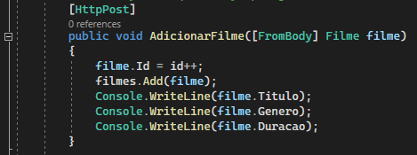

<h1 align="center" id="installEntityFramework"> ASP.NET - Development </h1>

<h2 id="files" align="center"> <i> Resume </i></h2>

<ol>
<li><a href="#init"> Init ASPNET </a></li>
<li><a href="#setting"> Setting of Project </a></li>
<li><a href="#controller"> Controllers </a></li>
<li><a href="#routes"> Routes and Methods </a></li>
<li><a href="#annotationAttributes"> Annotations Attribute's </a></li>
<li><a href="#pagination"> Pagination </a></li>
<li><a href="#statusCode"> Status Code </a></li>
<li><a href="#databaseConnection"> Database Connection </a></li>
</ol>

 
<h2 id="testUnit"> Init AspNET </h2>

- 
 Create a project as ASP.NET Core Wen App 

        
    

 

 
<h2 id="setting"> Setting of Project </h2>

- 
 In "Properties > launchSetting.json", we can see localhost and port of application. 

    

    

 
<h2 id="controller"> Controllers </h2>

- 
 The Controller will be responsible to manager the request created by user. The example below: 

    

 
<h2 id="routes"> Routes and Methods </h2>

- 
 Example Method <b> GET </b> 

    

- 
 Example Method <b> POST </b> receiving parameter. 

    

- 
 Returning data 

    

- 
 Example <b> [FromQuery] </b> receiving values by URL

    

    
    
- 
 Example <b> [FromBody] </b> receiving values by body request

    
    
    

 
<h2 id="annotationAttributes"> Annotations Attribute's </h2>

- 
 <b> [Required]</b>: Attribute can not be null

- 
 <b> [MaxLength()]</b>: Max caracters allowed

- 
 <b> [Range (init, end)]</b>: Value must be between these values 

- 
 <b> ErrorMessage</b>: You can define a custom message for that error

    

 
<h2 id="pagination"> Pagination </h2>

- 
 <b> Skip(int N)</b>: Jump N elements
- 
 <b> Take(int N)</b>: Get N elements to return

  -   Example: Skip 3 element and take 2. In this case, take contains default value (10)

        

        

        

    
 
<h2 id="statusCode"> Status Code </h2>

- 
 When element not found, will return: <b>"Not Found()"</b> 

    

    If filme is null, return method <b>"Not Found()"</b> - Status 404

    

- 
 When element was created, will return: <b>"Created()"</b> 

    

    return method "CreatedAtAction()" and path from element created - Status - 201

    
    
    
 
<h2 id="databaseConnection"> Database Connection </h2>

-   
 In "appsetting.json": 

    

-   
 Add the command with the credentials of database. Example: 

        "ConnectionStrings": {
            "FilmeConnection" : "server=localhost;database=filme;user=root;password=root"
        }

    

-   
 Now, we must define the connection of database for DBContext in "program.cs". 

        //String of connection database
        var connectionString = builder.Configuration.GetConnectionString("FilmeConnection");
                
        //Connect to datase
        builder.Services.AddDbContext<FilmeContext>(opts => opts.UseMySql(connectionString, serverVersion: ServerVersion.AutoDetect(connectionString)));

    
        
    
 
<h2 id="migration"> Creating Table from Classe (Migration) </h2>

-   
 Add a <b> [Key] </b> to identify "Id" as primary key and <b>[Required]</b> (not null) 

    

-   
 Open <b>"Package Manager Console"</b> and type:

        Add-Migration NameOfMigration
    
    

    

-   
 Will be added the folder <b>"Migrations"</b> 

    

-   
 To update in database, type: 

        Update-Database

-   
 Done! 

    