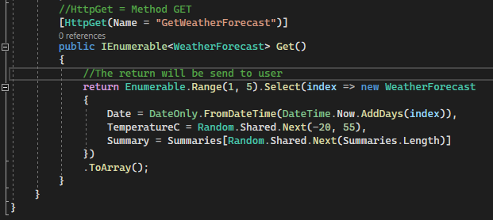

<h1 align="center" id="installEntityFramework"> ASP.NET - Development </h1>

<h2 id="files" align="center"> <i> Resume </i></h2>

<ol>
<li><a href="#init"> Init ASPNET </a></li>
<li><a href="#setting"> Setting of Project </a></li>
<li><a href="#controller"> Controllers </a></li>
<li><a href="#firstRoute"> First Route </a></li>
<li><a href="#attributesAnnotarions"> Attributes from Annotations xUnit </a></li>
<li><a href="#theoryClassDats"> Theory with ClassData </a></li>
<li><a href="#exception"> Test with Exception </a></li>
</ol>

 
<h2 id="testUnit"> Init AspNET </h2>

- 
 Create a project as ASP.NET Core Wen App 

        
    

 

 
<h2 id="setting"> Setting of Project </h2>

- 
 In "Properties > launchSetting.json", we can see localhost and port of application. 

    

    

 
<h2 id="controller"> Controllers </h2>

- 
 The Controller will be responsible to manager the request created by user. The example below: 

    

 
<h2 id="firstRoute"> First Route </h2>

- 
 Example Method <b> GET </b> 

    

- 
 Example Method <b> POST </b> receiving parameter. 

    

 
<h2 id="annotationAttributes"> Annotations Attribute's </h2>

- 
 <b> [Required] </b> = Attribute can not be null

- 
 <b> [MaxLength] </b> = Max caracters allowed

- 
 <b> [Range (init, end)] </b> = Value must be between these values 

- 
 <b> ErrorMessage </b> = You can define a custom message for that error

    