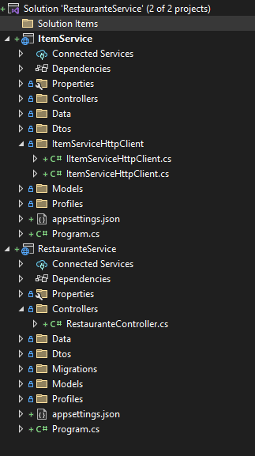
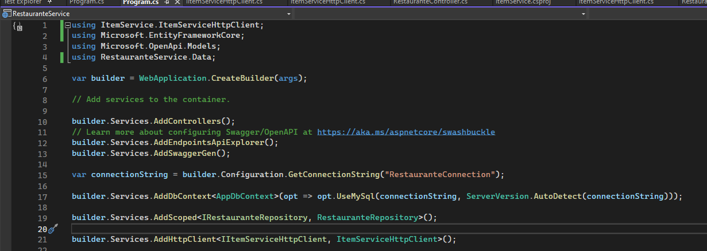

<h1 align="center" id="installEntityFramework"> API with RabbitMQ - Development </h1>

<h2 id="files" align="center"> <i> Resume </i></h2>

<ol>
<li><a href="#init"> Communication between services </a></li>
<li><a href="#setting"> Setting of Project </a></li>
<li><a href="#controller"> Controllers </a></li>
<li><a href="#routes"> Routes and Methods </a></li>
<li><a href="#annotationAttributes"> Annotations Attribute's </a></li>
<li><a href="#pagination"> Pagination </a></li>
<li><a href="#statusCode"> Status Code </a></li>
</ol>

 
<h2 id="init"> Communication between services </h2>

- 
  The project contains two services 

  

- 
 To connect "ItemService" to "RestauranteService", add in "Program.cs" (RestauranteService) the line below: 

      - builder.Services.AddHttpClient<IItemServiceHttpClient, ItemServiceHttpClient>();

  

