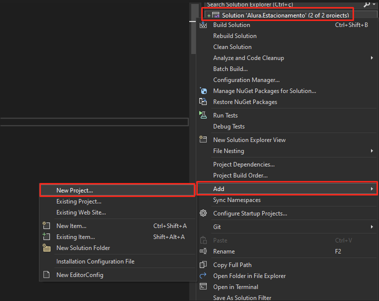
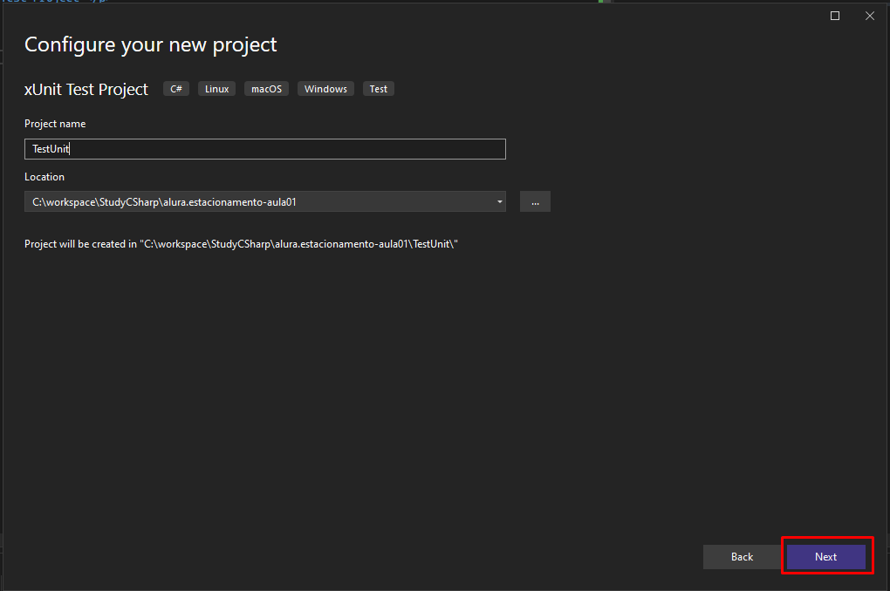
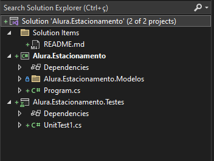
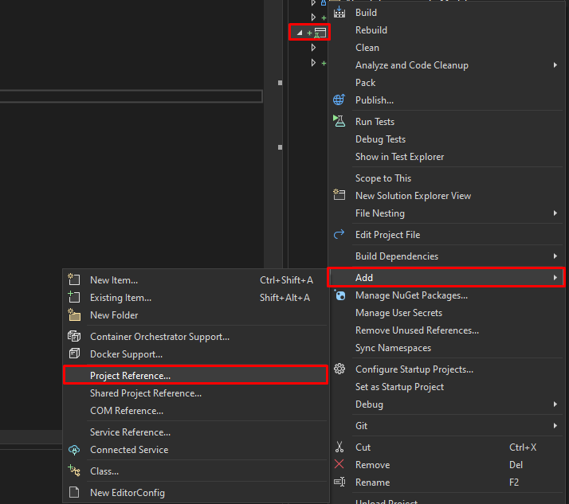
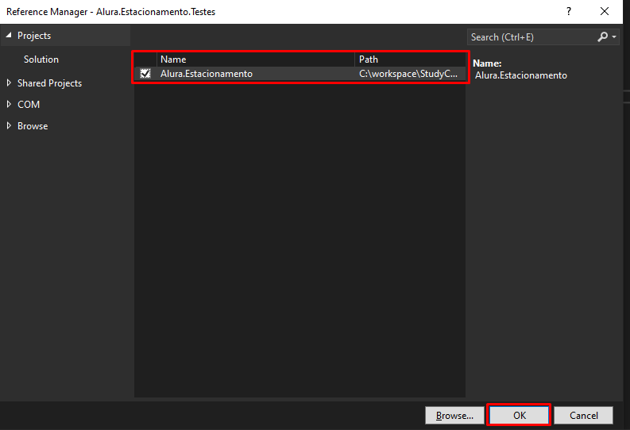
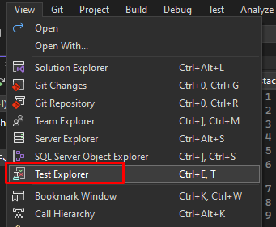
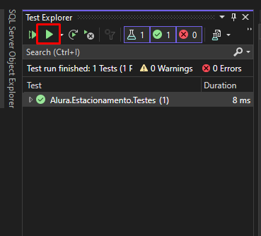
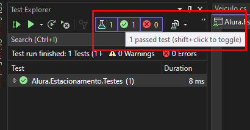
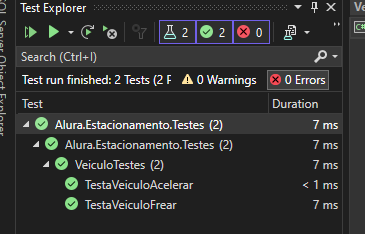

<h2> Test Unit </h2>

- 
 In project, add a new project as xUnit Test Project 

	
    

    

    

- 
 Project test added 

    

- 
 Now, you must add a reference in xUnit Test Project 

    

    

- 
 Testing method "Acelerar" from class "Veiculo" 

    Class "Veiculo" in Project
    
        public void Acelerar(int tempoSeg)
        {
            this.VelocidadeAtual += (tempoSeg * 10);
        }

    Class "VeiculoTestes" in xUnit Test

        public class VeiculoTestes
        {
            [Fact]
            public void TestaVeiculoAcelerar()
            {

                var veiculo = new Veiculo();
                veiculo.Acelerar(10);

                //Expected value 100 for the method and variable
                Assert.Equal(100, veiculo.VelocidadeAtual);
            }
        }

- 
 To test the function 

    

    

- 
 Results 

    

    

- 
 Repeting test for method "Frear 

    Class "Veiculo"
        
        public void Frear(int tempoSeg)
        {
            this.VelocidadeAtual -= (tempoSeg * 15);
        }
        
    Class "VeiculoTestar" in xUnit Test Project

        [Fact]
        public void TestaVeiculoFrear()
        {

            var veiculo = new Veiculo();
            veiculo.Frear(10);

            //Expected value -150
            Assert.Equal(-150, veiculo.VelocidadeAtual);

        }

    
    

- 
 Now, testing the method "TotalFaturado", class "Patio".

        [Fact]
        public void ValidaFaturamento()
        {
            //Arrange
            var estacionamento = new Patio();
            var veiculo = new Veiculo();
            veiculo.Proprietario = "João";
            veiculo.Tipo = TipoVeiculo.Automovel;
            veiculo.Cor = "Branco";
            veiculo.Placa = "asd-9999";

            estacionamento.RegistrarEntradaVeiculo(veiculo);

            estacionamento.RegistrarSaidaVeiculo(veiculo.Placa);

            //Act
            double faturamento = estacionamento.TotalFaturado();

            //Assert
            Assert.Equal(2, faturamento);

        }

<h2> Pattern AAA </h2>

- 
 <b>Arrange</b>: Preparing environment 

- 
 <b>Act</b>: What will be tested 

- 
 <b>Assert</b>: Results from the tests 

        [Fact]
        public void TestaVeiculoAcelerar()
        {
            //Pattern AAA
            //Arrange
            var veiculo = new Veiculo();

            //Act
            veiculo.Acelerar(10);

            //Assert
            Assert.Equal(100, veiculo.VelocidadeAtual);

        }

<h2> Annotations xUnix </h2>

- 
 Annotation [Fact], test simple 

  
        [Fact]
        public void TestaVeiculoAcelerar()
        {
            //Pattern AAA
            //Arrange
            var veiculo = new Veiculo();

            //Act
            veiculo.Acelerar(10);

            //Assert
            Assert.Equal(100, veiculo.VelocidadeAtual);

        }

- 
 Annotation [Theory], you may test with any values 

        [Theory]
        [InlineData ("João Silva", "ASD-1498", "preto", "Strada")]
        [InlineData("Joana Soares", "ESD-8752", "branco", "Gol")]
        [InlineData("Maria Branco", "CXZ-3654", "branco", "Jeep")]
        [InlineData("Antonio James", "QWE-5465", "vermelho", "Uno")]
        public void ValidaFaturamentoComVariosVeiculos(string propietario, string placa, string cor, string modelo)
        {
            //Arrange
            var estacionamento = new Patio();
            var veiculo = new Veiculo();
            veiculo.Proprietario = propietario;
            veiculo.Cor = cor;
            veiculo.Placa = placa;
            veiculo.Modelo = modelo;

            estacionamento.RegistrarEntradaVeiculo(veiculo);
            estacionamento.RegistrarSaidaVeiculo(veiculo.Placa);

            //Act
            double faturamento = estacionamento.TotalFaturado();

            //Assert
            Assert.Equal(2, faturamento);
        }