<h1 align="center" id="installEntityFramework"> CAT83 - Processamento </h1>

<h2 id="files" align="center"> <i> Sumário </i></h2>

<ol>
<li><a href="#testUnit"> Test Unit </a></li>
<li><a href="#patternAAA"> Pattern AAA </a></li>
<li><a href="#annotations"> Annotations xUnit </a></li>
<li><a href="#testCommandLine"> Test with command line </a></li>
<li><a href="#attributesAnnotarions"> Attributes from Annotations xUnit </a></li>
<li><a href="#theoryClassDats"> Theory with ClassData </a></li>
<li><a href="#exception"> Test with Exception </a></li>
</ol>

 
<h2 id="testUnit"> Test Unit </h2>

- 
 In project, add a new project as xUnit Test Project 

	
    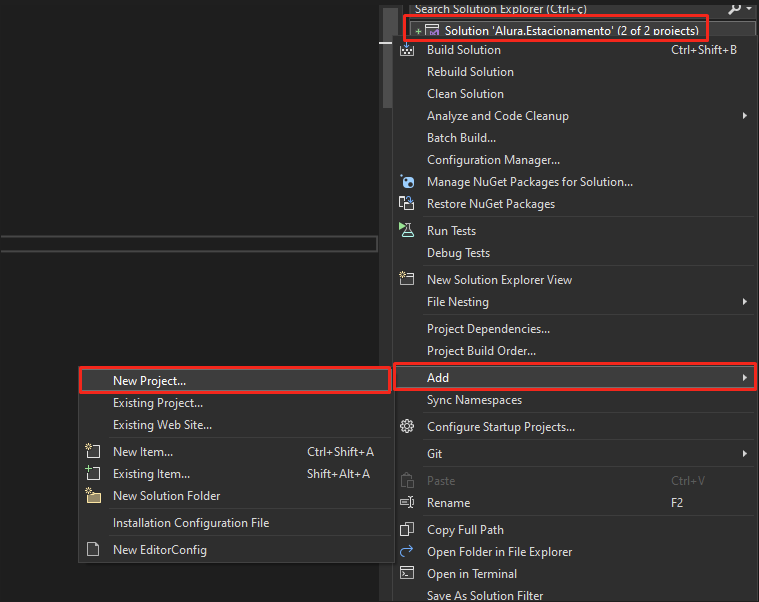

    

    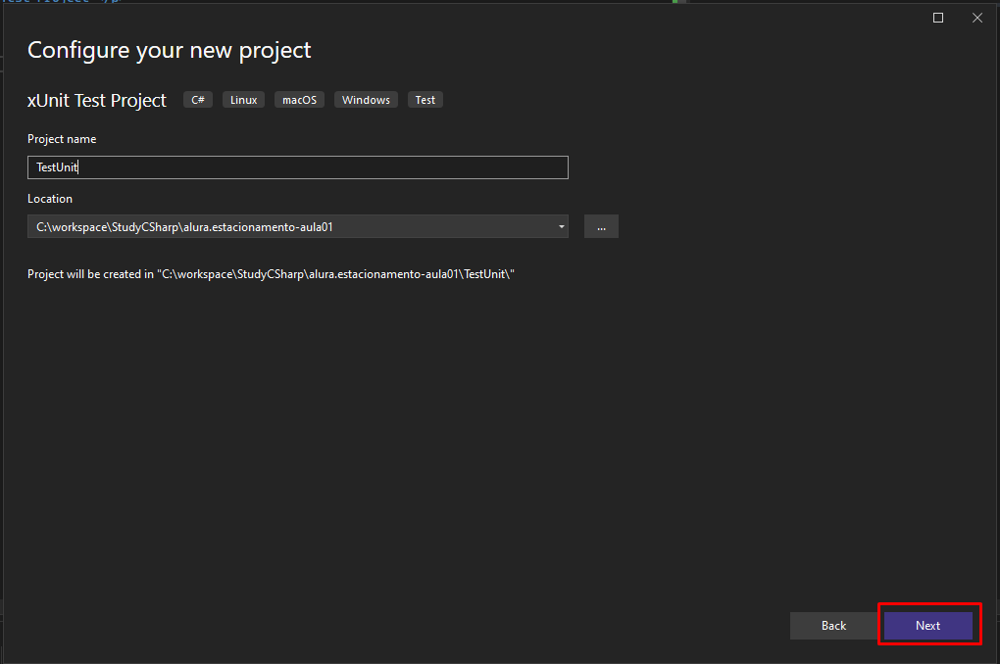

- 
 Project test added 

    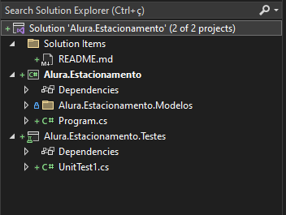

- 
 Now, you must add a reference in xUnit Test Project 

    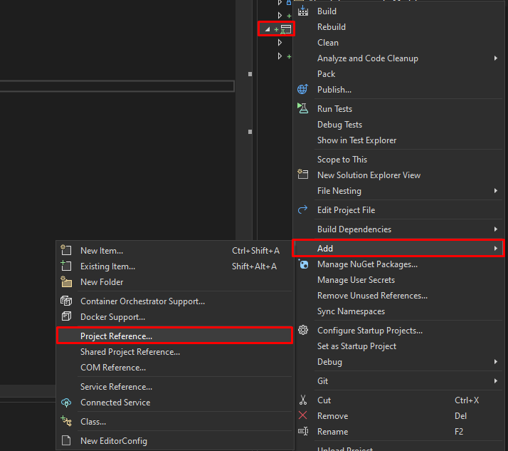

    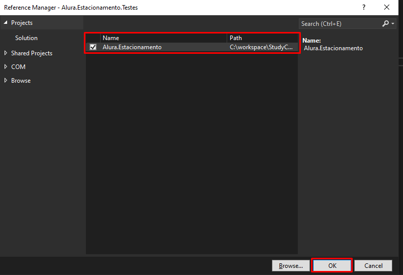

- 
 Testing method "Acelerar" from class "Veiculo" 

    Class "Veiculo" in Project
    
        public void Acelerar(int tempoSeg)
        {
            this.VelocidadeAtual += (tempoSeg * 10);
        }

    Class "VeiculoTestes" in xUnit Test

        public class VeiculoTestes
        {
            [Fact]
            public void TestaVeiculoAcelerar()
            {

                var veiculo = new Veiculo();
                veiculo.Acelerar(10);

                //Expected value 100 for the method and variable
                Assert.Equal(100, veiculo.VelocidadeAtual);
            }
        }

- 
 To test the function 

    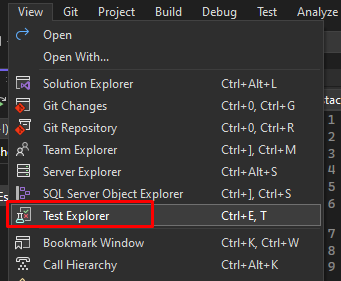

    

- 
 Results 

    

    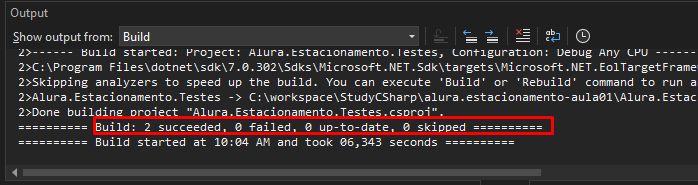

- 
 Repeting test for method "Frear 

    Class "Veiculo"
        
        public void Frear(int tempoSeg)
        {
            this.VelocidadeAtual -= (tempoSeg * 15);
        }
        
    Class "VeiculoTestar" in xUnit Test Project

        [Fact]
        public void TestaVeiculoFrear()
        {

            var veiculo = new Veiculo();
            veiculo.Frear(10);

            //Expected value -150
            Assert.Equal(-150, veiculo.VelocidadeAtual);

        }

    
    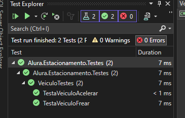

- 
 Now, testing the method "TotalFaturado", class "Patio".

        [Fact]
        public void ValidaFaturamento()
        {
            //Arrange
            var estacionamento = new Patio();
            var veiculo = new Veiculo();
            veiculo.Proprietario = "João";
            veiculo.Tipo = TipoVeiculo.Automovel;
            veiculo.Cor = "Branco";
            veiculo.Placa = "asd-9999";

            estacionamento.RegistrarEntradaVeiculo(veiculo);

            estacionamento.RegistrarSaidaVeiculo(veiculo.Placa);

            //Act
            double faturamento = estacionamento.TotalFaturado();

            //Assert
            Assert.Equal(2, faturamento);

        }

- 
 Method Contains, verify if param is in variable 

        [Fact]
        public void DadosVeiculo()
        {

            //Arrange
            var veiculo = new Veiculo();
            veiculo.Proprietario = "João";
            veiculo.Tipo = TipoVeiculo.Automovel;
            veiculo.Cor = "Branco";
            veiculo.Placa = "asd-9999";
            veiculo.Modelo = "Strada";

            //Act
            string dados = veiculo.ToString();

            //Assert
            Assert.Contains("Ficha do Veículo:", dados);
        }

 
<h2 id="patternAAA"> Pattern AAA </h2>

- 
 <b>Arrange</b>: Preparing environment 

- 
 <b>Act</b>: What will be tested 

- 
 <b>Assert</b>: Results from the tests 

        [Fact]
        public void TestaVeiculoAcelerar()
        {
            //Pattern AAA
            //Arrange
            var veiculo = new Veiculo();

            //Act
            veiculo.Acelerar(10);

            //Assert
            Assert.Equal(100, veiculo.VelocidadeAtual);

        }

 
<h2 id="annotations"> Annotations xUnix </h2>

- 
 Annotation [Fact], test simple 

  
        [Fact]
        public void TestaVeiculoAcelerar()
        {
            //Pattern AAA
            //Arrange
            var veiculo = new Veiculo();

            //Act
            veiculo.Acelerar(10);

            //Assert
            Assert.Equal(100, veiculo.VelocidadeAtual);

        }

- 
 Annotation [Theory], you may test with any values 

        [Theory]
        [InlineData ("João Silva", "ASD-1498", "preto", "Strada")]
        [InlineData("Joana Soares", "ESD-8752", "branco", "Gol")]
        [InlineData("Maria Branco", "CXZ-3654", "branco", "Jeep")]
        [InlineData("Antonio James", "QWE-5465", "vermelho", "Uno")]
        public void ValidaFaturamentoComVariosVeiculos(string propietario, string placa, string cor, string modelo)
        {
            //Arrange
            var estacionamento = new Patio();
            var veiculo = new Veiculo();
            veiculo.Proprietario = propietario;
            veiculo.Cor = cor;
            veiculo.Placa = placa;
            veiculo.Modelo = modelo;

            estacionamento.RegistrarEntradaVeiculo(veiculo);
            estacionamento.RegistrarSaidaVeiculo(veiculo.Placa);

            //Act
            double faturamento = estacionamento.TotalFaturado();

            //Assert
            Assert.Equal(2, faturamento);
        }

 
<h2 id="testCommandLine"> Test with command line </h2>

- 
 In "Package Manager Console", type:

        dotnet test

- 
 Return 

    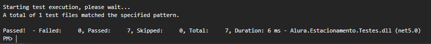

 
<h2 id="attributesAnnotarions"> Attributes from Annotations xUnit </h2>

- 
 <b> Attribute "Skip" </b>: The test will be skipped 

        [Fact(Skip = "Teste ainda não implementado. Ignorar")]
        public void ValidaNomePropietario()
        { }

- 
 <b> Attribute "DisplayName" </b>: The test will be renamed 

        [Fact(DisplayName = "Teste de frear")]
        public void TestaVeiculoFrear()
        {
            var veiculo = new Veiculo();
            veiculo.Frear(10);
            Assert.Equal(-150, veiculo.VelocidadeAtual);
        }

        
        
    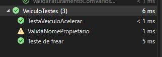
    
- 
 <b> Attribute "Trait" </b>: To organize the tests 

        [Fact]
        [Trait("Funcionalidade", "Acelerar")]
        public void TestaVeiculoAcelerar()
        {
            var veiculo = new Veiculo();
            veiculo.Acelerar(10);
            Assert.Equal(100, veiculo.VelocidadeAtual);
        }

        [Fact(DisplayName = "Teste de frear")]
        [Trait("Funcionalidade", "Frear")]
        public void TestaVeiculoFrear()
        {
            var veiculo = new Veiculo();
            veiculo.Frear(10);
            Assert.Equal(-150, veiculo.VelocidadeAtual);
        }

    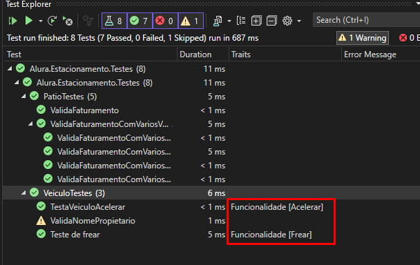

 
<h2 id="theoryClassDats"> Theory with ClassData </h2>

- 
 1º 

  
        public class Veiculo:IEnumerable<object[]>

- 
 2º 

        public IEnumerator<object[]> GetEnumerator()
        {
            yield return new object[]
            {
                new Veiculo
                {
                    Proprietario = "André Silva",
                    Placa = "ASD-9999",
                    Cor="Verde",
                    Modelo="Fusca"
                }
            };
        }

        IEnumerator IEnumerable.GetEnumerator() => GetEnumerator();

- 
 3º 

        [Theory]
        [ClassData(typeof(Veiculo))]
        public void TestaVeiculoClass(Veiculo modelo)
        {
            //Arrange
            var veiculo = new Veiculo();

            //Act
            veiculo.Acelerar(10);
            modelo.Acelerar(10);

            //Assert
            Assert.Equal(modelo.VelocidadeAtual, veiculo.VelocidadeAtual);
        }

 
<h2 id="exception"> Test with Exception </h2>

- 
 Testing exception from class "Veiculo" 

    //Class "VeiculoTeste"

        [Fact]
        public void TesteNomeProprietarioVeiculoComMenosDeTresCaracteres()
        {
            string nomeProprietario = "Ab";

            Assert.Throws<System.FormatException>(
                () => new Veiculo(nomeProprietario));
        }

    //Class "Proprietario"

        public string Proprietario
        {
            get
            {
                return _proprietario;
            }
            set
            {
                if (value.Length < 3)
                {
                    throw new System.FormatException(" Nome de proprietário deve ter no mínimo 3 caracteres.");
                }
                _proprietario = value;
            }

        }
    
- 
 Will return FormatException, as defined in the class 

    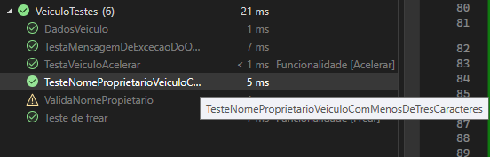